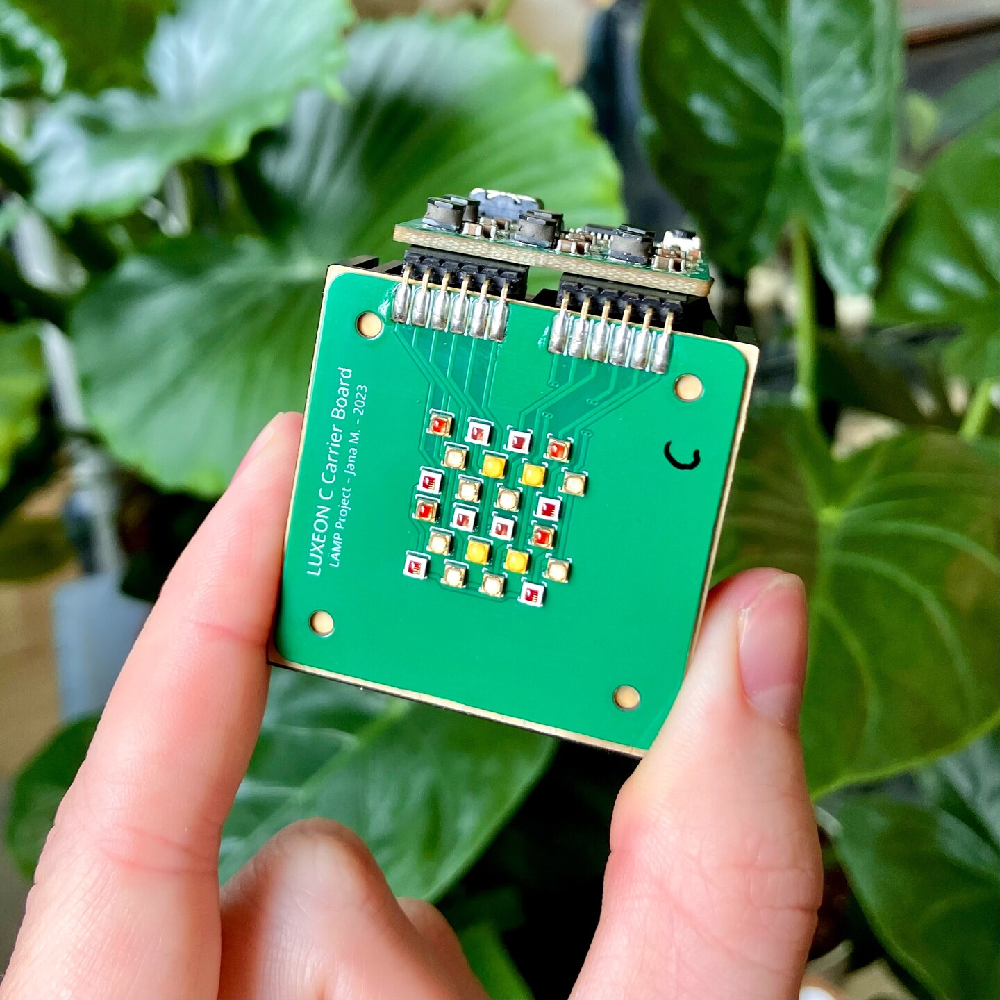
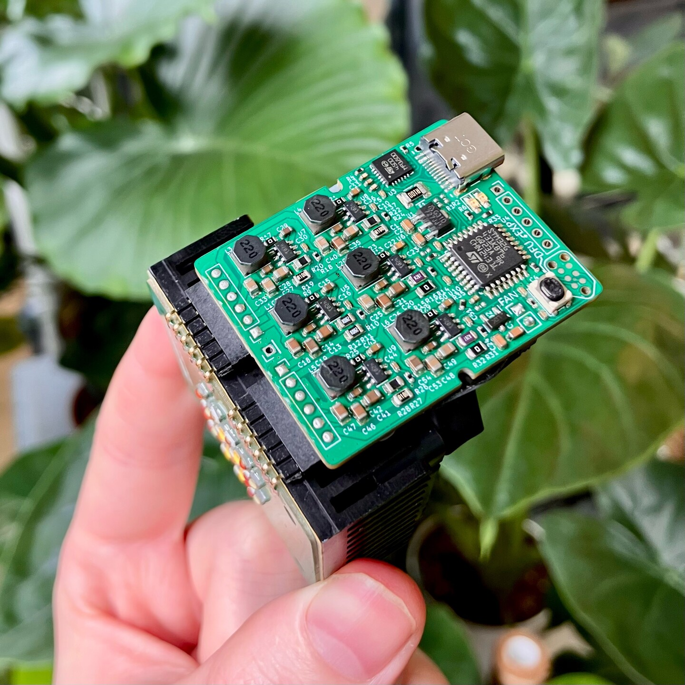
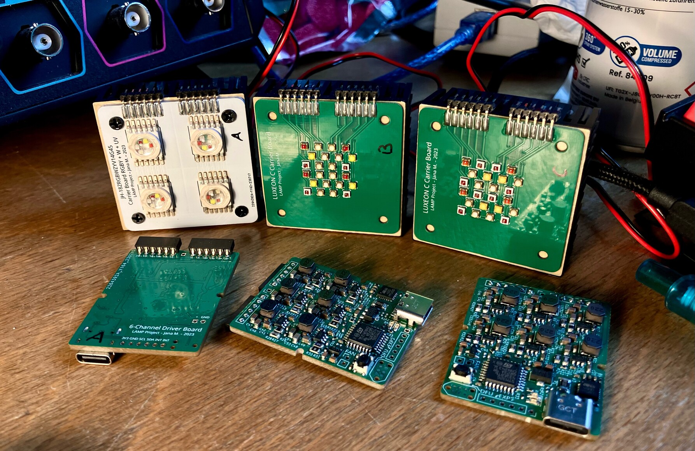
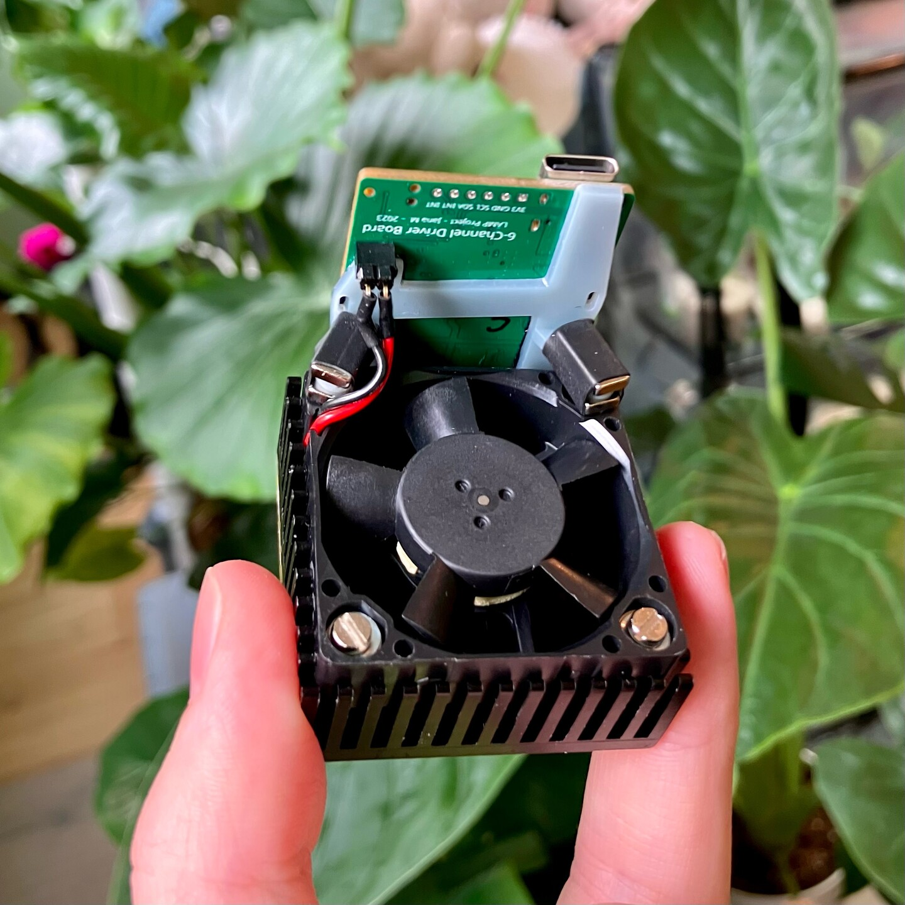

# LÄMP-Spöt

LÄMP-Spöt is an open source, multi-channel (multi-colour) LED spot that aims to deliver high quality effect-lighting through up to 6 LED-channels with ~10W each. This allows for a broader colour range than just RGB or RGBW, but RGB + non-mixed secondaries (i.e. RGB, Yellow, Cyan, Purple), RGB + Yellow + Whites, a variety of White tones (with degrees of Red, Blue and Green hues) and of course effect channels (i.e. UV, IR). In that, I have assembled various spöts that follow these suggestions, one that features RGBY + UV + IR, RGBY + IR + White and one with three channels of white + UV + IR for plants

<table>
	<tbody>
		<tr>
			<td>
				
			</td>
			<td>
				
			</td>
		</tr>
	</tbody>
</table>

Each spöt consists of at least an LED carrier and a driver board. The driver-board is fairly generic, but can be optimized for each LED board by conforming the DCDC-Shunts to match the maximum LED current of that channel. You can of course set all channels to max current in hardware and use software-limiting. The LED carrier boards are a bit more specific due to their LED footprints. In addition you will probably want to sink the LEDs heat to somewhere, I've chosen "LA ICK 17x17" heatsinks from fisherelektronik.

You can find a [video of a preliminary board in action here.](https://chaos.social/@janamarie/110854704275031346)

It's not neccesarrily fixed on a single LED series by virtue of the LED-carrier being interchangable. I focused myself on using the Luxeon C series, it featurs a high variety of colours in the same package, as well as various binned whites. There is also a breakout board for a 6-Channel (RGBY, W, UV), single package led, available through chinese companies.

<a href="https://otmm.lumileds.com/adaptivemedia/f5fbe66cb9d857d62d895f92b8d6be3cc5919925">
	<table>
		<tbody>
			<tr>
				<td colspan="6">
					Available Lumileds Luxeon C Color Series measured and published by Lumileds (click me to assess the source)
				</td>
			</tr>
			<tr>
				<td colspan="3">
					
				</td>
				<td colspan="3">
					
				</td>
			</tr>
			<tr>
				<td colspan="6">
					Available Lumileds Luxeon C White Series measured and published by Lumileds (click me to assess the source)
				</td>
			</tr>
			<tr>
				<td colspan="2">
					
				</td>
				<td colspan="2">
					
				</td>
				<td colspan="2">
					
				</td>
			</tr>
		</tbody>
	</table>
</a>

The driver-board hosts an STM32G431 with a huge surplus in computing power, allowing for generous colour-space conversions and color-to-wavelength matching. None of this is implemented as of right now (~09-2024). It requires a 15-20V USB-PD source to run. The MCU speaks USB FS through the Type-C receptacle as well. A 2mm pinheader with power, signals and I2C allows for connectivity through shield-like addons (blame me for only having USB FS as on-board connectivity :/). Each channel features a TPS54201 CC Buck as analog-current-source allowing each channel to run at up to 1.5A @ 20V.

**Please do not reproduce this project if you are not willing to put some work and money into your reproduction, it's mechanical setup is highly alpha and there is little firmware.**

<table>
	<tbody>
		<tr>
			<td>
				
			</td>
			<td>
				
			</td>
		</tr>
	</tbody>
</table>

---

## Schematics

<a href="https://github.com/Jana-Marie/LAEMP-Spoet/tree/main/led-driver/schematic.pdf">
	<table>
		<tbody>
			<tr>
				<td colspan="2">
					Link to PDF
				</td>
			</tr>
			<tr>
				<td>
					
				</td>
				<td>
					
				</td>
			</tr>
		</tbody>
	</table>
</a>

---

## Todos

 - [ ] Add a connectivity shield that allows for control via either DMX, Artnet or Other
 - [ ] Design a rigid case that features proper input jacks, a ¼ inch screw mount and proper cooling

### Bugs & PCB-enhancements

 - [ ] Improve cooling options
   - [ ] Connect the fan output to a PWM or enable
   - [ ] Add a temperature-probe for the fan

---

## License

Copyright Jana Marie Hemsing 2023.

This source describes Open Hardware and is licensed under the CERN-OHL-S v2.

You may redistribute and modify this source and make products using it under
the terms of the CERN-OHL-S v2 (https://ohwr.org/cern_ohl_s_v2.txt).

This source is distributed WITHOUT ANY EXPRESS OR IMPLIED WARRANTY,
INCLUDING OF MERCHANTABILITY, SATISFACTORY QUALITY AND FITNESS FOR A
PARTICULAR PURPOSE. Please see the CERN-OHL-S v2 for applicable conditions.

Source location: https://github.com/Jana-Marie/LAEMP-Spoet

As per CERN-OHL-S v2 section 4, should You produce hardware based on this
source, You must where practicable maintain the Source Location visible
on the external case of the Gizmo or other products you make using this
source.

